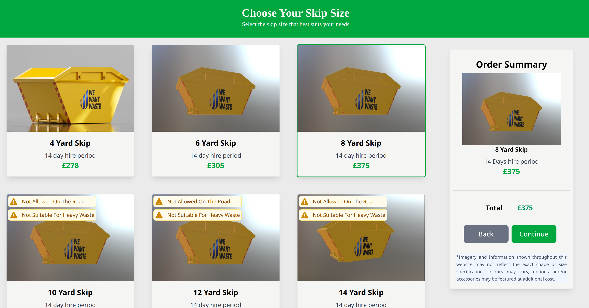

# SkipSize

SkipSize is a webpage to choose your desired skip size.

## Live Demo
 [SkipSize](https://liya-mary.github.io/SkipSize/)

## Tech Stack

- Frontend: React, Vite, TypeScript, Tailwind CSS.
- Deployment: Github Pages.

## Installation

- Install dependencies in the project.
- npm run dev.

## Features Implemented

- Users can browse available skips
- After selection, the app shows a summary of the selected skip, including size and price.
- Clean layout usiing Tailwind CSS, responsive for different screen sizes.

## Component Structure

1. App.tsx: Handles global state selected skip.
2. SkipContainer.tsx: Fetch skip data from api, storing skip list in local state and passing each item down.
3. SkipItem.tsx: Represents an indvidual skip item.
4. OrderSummary.tsx: Display details of the selected skip.
5. WarningBadge.tsx: Reusable badge component to highlight warnings on skips.

## Author
- [@liya-mary](https://github.com/liya-mary)

## Screenshots

  

